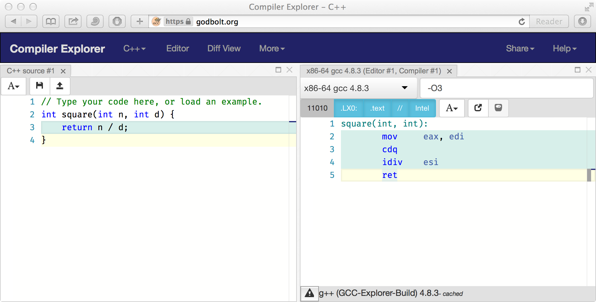
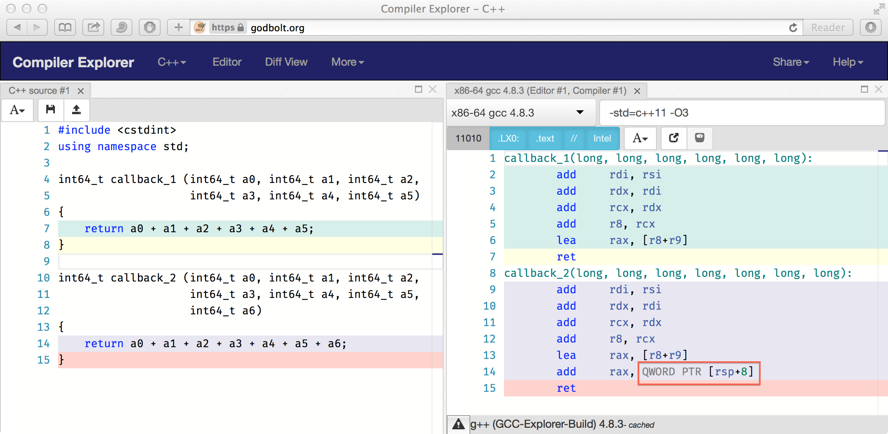
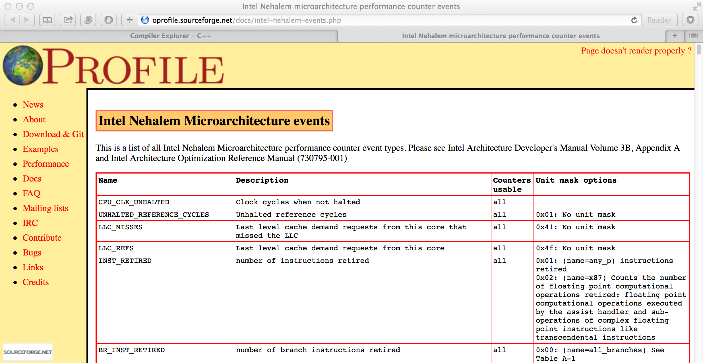

% HFT++, part 1
% Vlad Roubtsov
% May 8, 2017

There are many cool techniques in high performance C++ and we will see some of them today
(and more later, maybe), but right now my goal is to convince you to

> - **measure**: *establish a baseline* before attempting to speed up everything in sight
> - **understand**: once you have a usable "CPU+compiler model" in your head, techniques become *common sense*

# we start where many people finish: profiling

Today I will talk not so much about data structures or algorithms (market data books and such)
but rather suggest a different kind of intuition for low latency work.

This intuition comes from two sources:

1. understanding some things about CPUs
2. understanding some things about compilers

The textbook approach of thinking in terms of asymptotic O(...)-performance scaling is often
incorrect for HFT. I hope to convince you that starting in the opposite direction is
actually more appropriate when designing for low latency.

# a modern CPU

- **pipelined**: an interpreter of a *high-level language* called "x86 assembly"
    - $\mu$Ops, a "dispatcher", multiple redundant execution units
    
- **super-scalar**: can issue and potentially complete *more than one instruction per cycle* (IPC)
    - e.g. Nehalem could do up to 4 (max IPC = 4)
    
CPU is a like a tiny "cluster" with a "job scheduler" that tries to execute everything that can be
executed -- as long as it appears "serial" to us. 

. . .

There's more:

- **speculative execution**: CPU will look ahead for more work to do and try to predict branch outcomes,
first *statically* and then *dynamically* on repeat visits
- **branch predication**: some CPUs (Itanium) can execute *both* branch outcomes and
"merge" the results

# one takeaway already

- at any given moment, the CPU is not executing any one particular *single* line of code. Not even
a single x86 assembly instruction.
- in a tight loop, it is normal for the CPU to be prefetching, decoding, and speculatively executing
several next iterations
- so, if you insert a `rdtsc` somewhere -- [what exactly do you think are you capturing?](https://youtu.be/yB-JzPBJalA)

# things that are costly for a modern CPU

CPUs can no longer increase clock frequency, they rely on deeper pipelines to increase FLOPs.

1. anything that prevents the pipeline from being constantly full of things to do
    - **data hazards**: an instruction needs to wait for the result of another instruction
    - **control hazards**: `if-then-else` branches, function calls with dynamically calculated targets
2. anything that is costly algorithmically (`idiv`)
3. anything that is mechanically costly (memory access)

>**note:** data hazards are less costly than control hazards (CPU can use `store-and-forward`
techniques to make instruction results available internally sooner)

>**note:** static jumps are *not* expensive (easily prefetched) -- at least for the CPU

>**note:** very predictable dynamic jumps are *not* expensive either (dedicated hardware), but
they do consume finite hardware resources (BTB slots)

# a rough hierarchy of CPU-costly things

In approximate order of increasing costs:

                   operation     cost (cycles)
 ---------------------------    --------------
                     L1 miss         ~10
        branch misprediction         ~20
                     L2 miss         ~40
  signed int division (`idiv`)         ~100
                     L3 miss         ~200

Over the last few years the state of the art in data structure/algorithm design has evolved to reflect
these relative cost magnitudes. A few loose divisions here and there and we start talking a whole microsecond.

> **A quick example**: making bucket arrays in hashtables to be prime-sized is nice in theory, but not so
great in practice if it implies an `idiv` that the C++ `%` operator compiles to. By comparison,
power-of-2 sizing starts with a massive latency edge (a fast `and`).

# let's talk about C (plus plus)

C++: an ancient language kept alive by issuing hundreds of pages of new standardese every ~3 years.

It is useless for almost everything that's making Big Money today: www, mobile. So why do we use it?

. . .

- pretty much the only viable option for programming in the *"I understand what the assembly for this
  might look like"* mode
- there is hope: each new standard makes C++ more "modern" by stealing ideas from Java (mostly), Python, etc.

Ultimately, we want to remain "close enough" to hardware and that pipelined/super-scalar model of it
we've built in our heads.

<!---
in all fairness, new C++ features are driven by actual needs of practitioners and some of them allow
performance not possible in either C or C++03, so it pays to keep up with developments (CppCon talks)
-->

# things that are costly for a C++ compiler

- optimizing across a function call boundary
- reordering your class fields for better memory locality
    - language forbids this within the same access group (in practice everywhere)
- predicting your dynamic jump targets
    - including devirtualizing your virt fn calls (in most cases)
- being more like Fortran where *nothing is ever aliased*
- optimizing based on runtime data info (a la JVM)

<!---
    - aside: the deal with "strict aliasing" TODO link
    - DO NOT: turn off strict aliasing mode or suppress any resultant warnings instead of fixing them properly
-->

# pause for thought

Now we know what kind of things to be concerned about.

. . .

What we need are some ways of detecting them.

>Soon after we'll want to be able to peek under the hood.

# a timeless technique: peeking at the assembly

- often recommended but somewhat unwieldy: letting gcc stop at the assembly stage

~~~
  >g++ -std=c++11 -O3 -S -o main.asm main.cpp
~~~~
  
  or interlace with source code (if you're very enthusiastic)
  
~~~
  >g++ -std=c++11 -O3 -g -Wa,-aslh main.cpp > main.asm  
~~~~

- quicker ways:

~~~
  >objdump -d main
  >objdump -d main.o
  >objdump -d mylib.so
~~~~

- some of these options will require grepping output or will obfuscate logic due to incomplete relocations,
so I like this neat trick for examining a single function:

~~~
  >gdb -batch -ex 'file ./main' -ex 'disassemble my_fun'  
~~~~

- also: gdb, disassembly view in Eclipse debugger

<!---
- adding your own asm markers
-->
    
# when in doubt, ask God

[godbolt](https://godbolt.org) is indispensable for examining what-if scenarios for short-ish code snippets
in different compilers and with different compiler options

{ width=75% }

# case study: what do `LIKELY()` and `UNLIKELY()` actually accomplish?

my version is typical:

~~~{.cpp}
  #define VR_LIKELY(condition)        __builtin_expect(static_cast<bool> (condition), 1)
  #define VR_UNLIKELY(condition)      __builtin_expect(static_cast<bool> (condition), 0)
~~~~~~~~~~~~~~~~

/UNLIKELY()"){ width=70% }

# case study: the curious case of a callback with too many arguments

see the effects of the x86-64 ("itanium") ABI

{ width=70% }

# case study: the curious case of a callback with too many arguments, cont'd

   parameters in registers
-  ----------------------------------
   RDI, RSI, RDX, RCX, R8, R9, XMM0–7

The magic number to remember for int arguments is *6*.

Note that small PODs with int fields *can* be passed via registers:

{ width=70% }

<!---

# case study: avoiding branches in if-statements (&)

- short-circuiting has a dark side

# case study: single-branch versions of double checks; branchless if-then-else; cmov

- gcc is smarter than you think; it can even shift bits around to stuff more int values into arg registers
- cmov vs a single predictable branch (TODO link to discussion)

# case study: `volatile` considered harmful (and it doesn't do what you think it does)

- Linux's (or Linus') `ACCESS_ONCE()`

# another timeless technique: `strace` and `ltrace`

# case study: how expensive is a syscall?

- are there any syscalls that aren't expensive?

-->

# tools and techniques for profiling

- (really) old school: compiler instrumentation
    - compiler provides hooks, you need to figure out how to measure and log timing data yourself
    - it's a challenge to do so non-intrusively (at HFT scales)

- old school: gperftools
    - only CPU time (superceded by more modern tools) and memory
    - not bad, considering the libs can always be linked in and will lie "dormant" unless enabled via
env variables
        - tcmalloc will warn about "large memory allocations" (usually your bug, e.g. in data unmarshalling code)
        - tcmalloc will warn about duplicate delete's (mixing static and dynamic linking, etc) 

# old-ish school: reading TSC

Seems easy to use and on modern CPUs no issues with "unstable TSC frequency", but lots of details
involved in making this technique provide reliable data:

- disable hyperthreading (what are HTs, really?)
- run on real hardware representative of production runtime, not virtualized
- disable CPU governors/prevent power state changes
- pin threads to different **cores** (not hyperthreads) similar to production deployment
- cross-socket memory traffic is more expensive, but measure whatever production setup is
- quiescent machine; avoid interference from other apps (avoid core #0, etc)
- important: get memory/instruction caches into "known"/reproducible state before starting to measure
    - easiest is just to force the CPU to read through dummy mem data of known size
    - choice of L1, L2, L3, etc depends on the expected production use case (easier said than done)
- **important:** decide how much fencing to do; accuracy vs overhead; Shrodinger TSC values
    - to loop or not to loop: single instruction latency != pipelined instruction latency
- **important:** use stable stats metrics (can't avoid interference from interrupts, etc)
- **important:** subtract the overhead of measurement itself (different ways of doing that)

A fine technique if you just want cycle timings **and** you have the necessary framwork for
reproducible results, but a lot of people get lazy here. 

<!---

# case study: faster than fast int divide

note: compiler will not emit an `idiv` unless it absolutely has to; `x / <compile-time const>` will
be transformed into an equivalent operation that uses shifts, muls, adds, etc

-->

# oprofile: getting easier and more interesting at the same time

Not your father's profiler any more, but not spending much time here today because
the perf suite (next) seems strictly better since it enjoys full kernel support

{ width=80% }

# perf: modern Linux profiling with hardware counters

dedicated hardware almost always preferred to source code instrumentation; except for overhead of
storing data samples, no performance impact; additionally, `perf` tooling is directly supported by
the kernel (which makes it thread- and process-context switching-aware)

familiarity with CPU-specific registers is useful: certain events can be programmed to collect data
not available any other way, e.g. cross-socket traffic (Uncore)

hardware can be programmed to record the exact location (IP) of an "event", which can be mapped to
the source code later

number of perf registers is limited; for accurate accounting, use a small set of events to avoid
approximation noise due to "multiplexing"

possibly the single most important aggregate metric: IPC; know what the theoretical peak hardware value is

perf cli:
- `perf record`, `perf report`
    - by default, perf API can't break counts down by threads of a process, so use `-a -C ...` options

# case study: flogging the dead virt function horse

. . .

- (very) poor man's "devirtualization"

<!---

# case study: false (or not) sharing
   
# case study: cache capacity (?) misses

- sometimes aligning *everything* on power-of-2 addresses is not ideal

-->

# suggestions for practice

- use dedicated "perf test cases" to isolate and profile select areas and data structures

# C++ IDE support for profiling has really improved in recent years
- and by "a helpful C++ IDE" I mean Eclipse: see [Linux Tools](https://eclipse.org/linuxtools/)
    - my usual impression of an Emacs or vim C++ coder: furious typing for 1 min just to open a file 
- see [Eclipse PERF User Guide][]
    - no more being a slave to Intel compiler and VTune
- perf profiling, `Perf Profile View`
    - comparing [perf profiles](http://www.eclipse.org/linuxtools/projectPages/perf/)
    - source disassembly view, stat view
- `Perf Events` configuration tab: select events

<!---

(don't forget to enable c++11 dialect)

-->

[Eclipse PERF User Guide]: http://wiki.eclipse.org/Linux_Tools_Project/PERF/User_Guide
